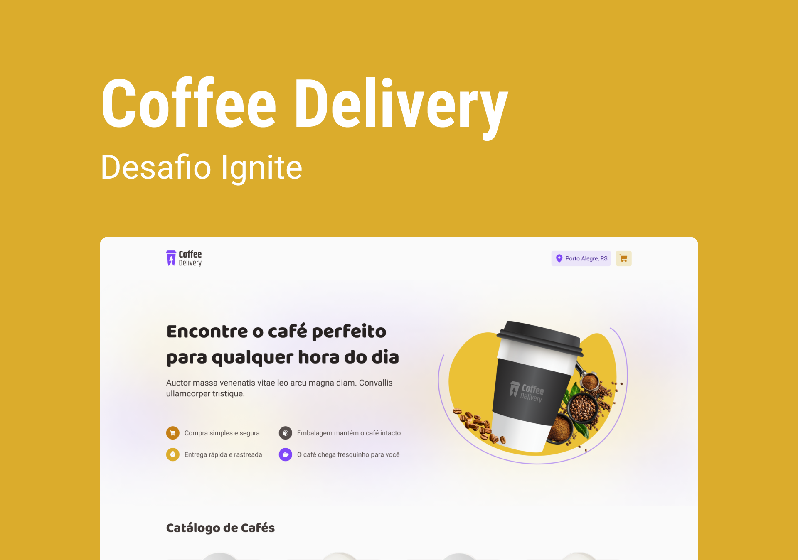

# 2nd challenge: Coffee Delivery 

2nd challenge of Rocketseat 🚀, which was proposed to make a coffee delivery web application, that consists in the following screens: home, check out and delivery pages.

## Getting started
To use this project, you must only is necessary to run the following code

```sh
npm i
```
and before install all dependencies, you must run

```sh
npm run dev
```
##

You can see the screens of this project in https://github.com/cintiasc/02-challenge-coffee-delivery/.github/assets.

## Useful links

- [Rocketseat](https://www.rocketseat.com.br)
- [React project](https://reactjs.org)
- [Styled Components](https://styled-components.com)
